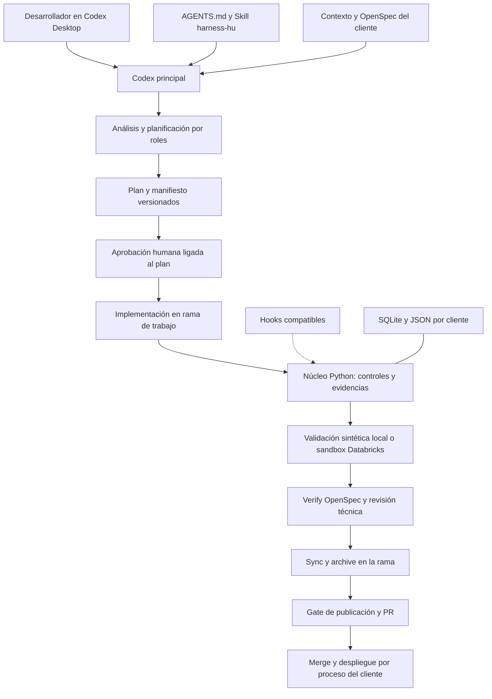

# Propuesta de Harness Local para Codex Desktop

Fecha de validación: **8 de octubre de 2026**. Plataforma inicial: Windows. Estado: **diseño para iniciar implementación; el kit todavía no existe**.

## 1. Resultado y objetivo

La propuesta es viable: usar **Codex en la aplicación de escritorio como interfaz y motor de agentes**, OpenSpec como proceso de especificación y un núcleo Python reducido para los controles propios del harness. Databricks permanece como entorno de ejecución y validación remota cuando las pruebas lo requieren.

El objetivo es que un desarrollador prepare su equipo una vez, vincule un repositorio cliente con una configuración inicial y trabaje sobre HUs desde Desktop. Las reglas comunes deben evolucionar en un producto independiente; las reglas de negocio, especificaciones y código deben permanecer en cada cliente.

No basta con cambiar endpoints en `models.py`: en esta modalidad Codex realiza la inferencia y dirige sus herramientas. El runtime Python existente deja de invocar al planner/developer/verifier. Se reutilizan contratos y controles, adaptando los que dependían de la mediación del runtime original.

La viabilidad se apoya en lectura de código, documentación oficial y pruebas locales acotadas. **No se ha demostrado todavía una HU completa con agentes personalizados, hooks y sandbox remoto desde Desktop.** Esa demostración es un criterio de aceptación del primer incremento.

## 2. Bases revisadas y alcance de la evidencia

### Repositorios

Se descargaron copias de lectura de las ramas solicitadas. La propuesta usa estas revisiones, no una suposición sobre el contenido de `main`:

| Repositorio | Rama | Commit revisado |
| --- | --- | --- |
| Demo-Harness-Databricks | `Db_Spec_Harness` | `bb559dea91e1a32180c1c8e97b9a5c0b15077593` |
| Naturapet_DLH | `develop` | `c5efcf154c7e56101e6dd6c3ea830f6512e6b184` |

Se leyó la referencia a «Adaptar Harness Local». Su lectura devuelve parte de las respuestas como referencias internas, por lo que el **texto completo aportado en esta solicitud** se utilizó como base para auditar las propuestas.

### Pruebas en este equipo

| Comprobación | Resultado observado | Qué demuestra |
| --- | --- | --- |
| Databricks CLI | `v1.18.0` | El ejecutable está instalado |
| `databricks aitools install --help` | Admite `--agents`, `--skills-only`, `--scope`, `--path` y `--skills` | La superficie de instalación propuesta existe en esta versión |
| OpenSpec | `1.13.2` | Coincide con la versión compatible del perfil NaturaPet del harness |
| `openspec init --tools codex --profile core --no-animation` en una carpeta de prueba | Generó seis Skills en `.agents/skills`; omitió comandos; informó que `verify` es adicional | Codex usa Skills y el perfil básico no incluye verificación |
| `openspec validate --help` | Admite validación de specs/cambios, `--strict` y `--json` | Hay validación estructural determinista de OpenSpec |
| `databricks bundle validate --help` | Admite `--strict`, target y perfil | Hay comando de validación del bundle; no demuestra ejecución de notebooks |
| Node / Python | `v24.15.0` / `3.13.14` | Existen runtimes locales; no son aún una matriz certificada del kit |
| Motor Codex incluido en la instalación | `codex-cli 0.162.0-alpha.2` | Se identificó el binario; no equivale a certificar la versión de la interfaz Desktop |

La consulta de versión de Codex emitió advertencias de permisos sobre carpetas temporales. No se invocó una sesión CLI como sustituto de Desktop. No se instalaron Skills globales, no se alteró la configuración de Codex, no se autenticó contra Databricks y no se ejecutaron jobs ni despliegues.

## 3. Auditoría de las propuestas del chat

| Propuesta | Evaluación | Ajuste necesario |
| --- | --- | --- |
| Codex Desktop reemplaza la App como interfaz y orquestador | **Viable** | Usar un proyecto local con herramientas de ejecución; el chat general y una sesión Work alojada no equivalen al mismo entorno local |
| `AGENTS.md` orquesta las fases | **Viable como instrucciones** | Codex toma las decisiones; Markdown no es una máquina de estados ni un control de acceso |
| Agentes personalizados en `.codex/agents/*.toml` y `~/.codex/agents/` | **Documentado** | Verificar descubrimiento y selección del rol en la instalación Desktop del piloto |
| `[agents] enabled` y `max_concurrent_threads_per_session` | **Documentado actualmente** | Fijar compatibilidad de motor; no trasladar ejemplos antiguos sin validación |
| Un agente por fase OpenSpec | **Posible, poco conveniente como obligación** | Mantener roles especializados; ejecutar fases breves en el principal |
| Las Skills pueden usar scripts y herramientas | **Viable** | Instruyen al agente; no conceden permisos ni garantizan por sí solas que un control se ejecutó |
| Una Skill llama un hook | **Descripción incorrecta** | Los hooks se activan por eventos del motor; una Skill puede usar el mismo script mediante un comando explícito |
| `.codex/hooks.json` y eventos de inicio, herramientas, compactación y cierre | **Documentado actualmente** | Requieren confianza; comprobar cobertura con las herramientas reales del piloto |
| Los hooks garantizan toda la seguridad y toda la auditoría | **No** | Hay rutas excluidas y errores que pueden permitir continuación; combinar con controles del adaptador y permisos externos |
| SQLite y JSON dan recuperación | **Viable, con adaptación** | Recuperan estado de negocio y evidencias; no restauran el contexto interno ni una operación LLM interrumpida |
| `context_manager.py` controla la ventana y el costo de Codex | **Solo parcialmente** | Puede limitar fuentes aportadas por el kit; no controla el prompt interno, herramientas o compactación de Codex |
| Cambiar Sonnet/Haiku por modelos OpenAI en `models.py` | **No para esta modalidad** | Configurar modelos de los roles Codex. Un runtime Python con API OpenAI sería otra modalidad |
| Costo exacto por HU en Desktop | **No demostrado** | Registrar consumo observado si existe; datos ausentes deben ser `null`, no estimaciones presentadas como factura |
| `harness init`, `doctor`, `update` y `winget Crea.Harness` | **Producto por desarrollar** | Ninguno debe presentarse como comando del harness disponible hoy |
| Instalación en uno o dos comandos | **Viable como experiencia objetivo** | Login, confianza y políticas corporativas pueden requerir interacción adicional |
| Plugin privado/local para Skills, MCP y hooks | **Documentado, condicionado por superficie** | No asumir que empaqueta y activa automáticamente agentes TOML, Python o dependencias de sistema |
| App Server requiere interfaz propia | **Exagerado** | Puede usarse desde una integración sin interfaz propia; igualmente añade responsabilidad de protocolo y operación |
| Mantener App y Desktop sobre un núcleo compartido | **Buena dirección futura** | Extraer primero piezas pequeñas; no diseñar ahora dos motores completos |

Fuentes de capacidades: [subagentes](https://learn.chatgpt.com/docs/agent-configuration/subagents), [referencia de configuración](https://learn.chatgpt.com/docs/config-file/config-reference), [Skills](https://learn.chatgpt.com/docs/build-skills), [hooks](https://learn.chatgpt.com/docs/hooks), [plugins](https://developers.openai.com/plugins/build/plugins) y [App Server](https://learn.chatgpt.com/docs/app-server). Los ejemplos del chat deben considerarse propuestas sujetas a esas interfaces y a la versión instalada.

## 4. Qué existe realmente en los repositorios

### Harness

El producto actual no es solamente una colección de prompts. Su runtime controla operaciones propuestas por modelos y mantiene aprobaciones, estados y evidencias.

- `client_config.py` carga un perfil seleccionado por el operador y verifica integridad, tamaño, campos, secretos y enlaces. El repositorio cliente no activa la política por sí mismo.
- `skills.py` contiene `MEDIATED_SYSTEM`: el modelo propone contratos JSON; no recibe autorización para ejecutar shell ni editar directamente. Consumir esas Skills de forma nativa en Codex cambia este modelo de ejecución.
- `coordination.py` implementa `SqliteRunCoordinator` con versiones y leases, además de un adaptador Delta.
- `store.py` contiene `LocalRunStore`, registros JSON y checkpoints.
- `sandbox_job.py` empaqueta el checkout, sube a un Volume aislado y comprueba identidad y hash de resultados. Tiene dependencias inyectadas `api` y `files`: es un buen punto para introducir autenticación local vía SDK, manteniendo el CLI para instalación y diagnóstico.
- `failure_routing.py` separa errores de implementación, alcance/spec, infraestructura/evidencia y defectos del harness. `conversation.py` limita las correcciones automáticas a dos por intento.
- `config/defaults/models.yaml` usa Sonnet 5.5 y Haiku 4.5 mediante Databricks. Sus tarifas no sirven para Codex.
- `config/defaults/context.yaml` declara `enabled: false`. Esto describe el valor por defecto revisado; no prueba qué configuración efectiva usa cada instalación.

El perfil de ejemplo NaturaPet es versión `3`, parte de `develop`, soporta OpenSpec `1.13.2`, permite hasta 40 archivos y 2 MB para `general_patch`, y protege instrucciones y OpenSpec frente al editor general. Hay que conservar las vías diferenciadas para actualizar artefactos OpenSpec.

Fuentes: [instrucciones del harness](https://github.com/srinconr-Crea/Demo-Harness-Databricks/blob/bb559dea91e1a32180c1c8e97b9a5c0b15077593/AGENTS.md), [perfil](https://github.com/srinconr-Crea/Demo-Harness-Databricks/blob/bb559dea91e1a32180c1c8e97b9a5c0b15077593/examples/naturapet/client-profile.yaml) y [configuración de instalación](https://github.com/srinconr-Crea/Demo-Harness-Databricks/blob/bb559dea91e1a32180c1c8e97b9a5c0b15077593/docs/configuracion-instalacion.md).

### NaturaPet

Ya existen `.agents/skills/openspec-*` para explore, propose, update, apply, verify, sync y archive; la Skill de verify declara `generatedBy: 1.13.2`. Existen `openspec/config.yaml`, specs, baseline, notebooks por dominio/capa, `src/common`, configuración, tests y jobs en un bundle con targets dev/qa/prod.

En el árbol revisado no aparecen `AGENTS.md`, `.harness/client.yaml` ni agentes `.codex/agents`. Son elementos de onboarding por agregar si se adopta el diseño, no archivos que puedan darse por instalados.

`openspec/config.yaml` ya exige aprobación vigente del plan/manifiesto, rama `feature/*`, pruebas sintéticas y publicación mediante PR. También prohíbe ejecutar jobs/pipelines o modificar tablas/catálogos reales de NaturaPet. El primer piloto local debe conservarlo.

Fuentes: [configuración OpenSpec](https://github.com/srinconr-Crea/Naturapet_DLH/blob/c5efcf154c7e56101e6dd6c3ea830f6512e6b184/openspec/config.yaml), [Skill verify](https://github.com/srinconr-Crea/Naturapet_DLH/blob/c5efcf154c7e56101e6dd6c3ea830f6512e6b184/.agents/skills/openspec-verify-change/SKILL.md) y [bundle](https://github.com/srinconr-Crea/Naturapet_DLH/blob/c5efcf154c7e56101e6dd6c3ea830f6512e6b184/databricks.yml).

## 5. Arquitectura recomendada y alternativas

| Alternativa | Aporta | Costo de mantener | Decisión |
| --- | --- | --- | --- |
| Codex Desktop + kit local | Interfaz, herramientas y delegación nativas; controles de negocio propios | Moderado | **Primera opción** |
| FastAPI local + modelos OpenAI por API | Conserva mediación del runtime y medición propia de llamadas | Mantener UI, bucle de agentes, autenticación API y facturación separada | Solo si se necesita controlar todas las llamadas desde Python |
| Integración sobre App Server | Control programático de sesiones y eventos | Protocolo, aprobaciones, compatibilidad y recuperación de la integración | Posponer hasta tener una necesidad concreta |



El núcleo controla transiciones de negocio y sus propios adaptadores; Codex controla la conversación. La Skill coordina ambos. El estado persistido no debe intentar duplicar cada mensaje del chat.

## 6. Separación del producto, clientes y estado

### Repositorio del producto

Este workspace `Local-Harness` puede convertirse en el repositorio del kit. La estructura siguiente es propuesta; hoy solo se ha creado este documento.

```text
Local-Harness/
  src/harness_core/       # Contratos, políticas, estado, hashes, evidencia
  src/harness_local/      # Comandos y adaptadores locales
  skills/
    harness-hu/          # Procedimiento principal
    harness-context/
    harness-validation/
    harness-client-onboarding/
  agent_templates/       # Roles Codex genéricos
  plugin/                # Distribución opcional de Skills/hooks/MCP
  installer/             # Bootstrap Windows y empaquetado
  schemas/               # Contratos del kit
  tests/                 # Pruebas genéricas con fixtures sintéticos
  docs/
```

El núcleo no debe contener nombres de catálogos NaturaPet, rutas de notebooks de un cliente ni perfiles productivos. Los ejemplos deben ser sintéticos; un adaptador específico puede distribuirse por separado.

### Repositorio target

```text
C:/Proyectos/Naturapet_DLH/
  AGENTS.md                         # Reglas aplicables a este cliente
  .codex/config.toml                # Ajustes compatibles del proyecto
  .codex/agents/                    # Roles generados/versionados si se elige alcance repo
  .agents/skills/openspec-*/         # Ya existen
  .agents/skills/naturapet-*/        # Conocimiento de negocio, si aplica
  .harness/client.yaml              # Descriptor portable, sin credenciales
  .harness/kit.lock.json             # Versiones y hashes requeridos
  openspec/                         # Specs y cambios del cliente
  src/, notebooks/, conf/, resources/, tests/
```

El desarrollador abre **la carpeta del cliente** como proyecto Codex. No trabaja sobre una copia de su código dentro del paquete genérico. El instalador no copia el bundle del harness dentro del target.

Para el piloto, es preferible generar agentes en el repo y revisarlos junto con el onboarding. Más adelante se pueden instalar agentes genéricos globales. Evitar duplicar nombres en ambos alcances y asumir reglas de precedencia sin probarlas.

### Estado del desarrollador

Ubicación propuesta: `%LOCALAPPDATA%/CreaHarness/clients/<client-id>/<checkout-id>/`. Debe separar registros, SQLite, perfiles seleccionados, snapshots y asociaciones de perfiles Databricks por cliente y checkout. El identificador de checkout distingue clones y worktrees.

Los registros y credenciales no se versionan. Las evidencias sanitizadas relevantes pueden acompañar el PR mediante un archivo o referencia verificable. El paquete genérico se comparte; datos, contexto y permisos del cliente no.

### Configuración: tres contratos diferentes

1. **Descriptor del repo:** qué proyecto es y qué compatibilidad requiere.
2. **Política seleccionada por el operador:** repositorio, rutas, operaciones, recursos y límites autorizados.
3. **Binding del desarrollador:** carpeta local, perfil OAuth elegido y ubicación de estado.

Un hash acredita integridad, no autorización. La confianza procede de quién seleccionó la política y cómo se protege. En un PC controlado por el desarrollador, los archivos locales no constituyen por sí solos una barrera contra ese usuario.

Ejemplo **nuevo** de descriptor; no es un YAML aceptado actualmente por `ClientProfile`:

```yaml
schema_version: 1
client_id: naturapet
repository: srinconr-Crea/Naturapet_DLH
base_branch: develop
branch_prefix: feature/
openspec_root: openspec
policy_ref: naturapet-pilot-v1
validation_plan: synthetic-sandbox
```

El binding local contendría `databricks_profile`, host esperado, job sandbox autorizado y rutas de estado. Los valores se eligen durante onboarding; `NATURAPET_DEV` o `CREA_DEV` no deben asumirse sin selección. El nuevo esquema debe validarse explícitamente y migrarse por versión.

## 7. Roles, modelos y Skills

| Rol | Responsabilidad propuesta | Cuándo usar subagente |
| --- | --- | --- |
| Principal/orquestador | Mantener HU, decisiones, aprobaciones y secuencia | Es la conversación activa |
| Impact analyzer | Recuperar dependencias, contratos e impacto | Investigación amplia; devolver referencias, no todo el contenido |
| Planner | Redactar propuesta, diseño, tareas y manifiesto | Cambios complejos; en una HU pequeña puede hacerlo el principal |
| Developer | Implementar el alcance aprobado | Un solo escritor por conjunto de archivos |
| Verifier/reviewer | Contrastar candidato con criterios y evidencia | Revisión independiente; no modificar código durante revisión |

Conservaría las responsabilidades del planner, developer y verifier actuales, **adaptando sus contratos**. El developer de Codex puede editar directamente: no es el editor JSON determinista original. El verifier asesor no se convierte automáticamente en autoridad de aprobación humana.

Como política inicial de modelos OpenAI: usar el modelo disponible del principal para planificación y desarrollo; habilitar un modelo más económico para investigación acotada si supera las evaluaciones. La documentación y esta sesión exponen `gpt-6.1-sol` y `gpt-6-luna`; su uso en otra cuenta debe comprobarse. No trasladar `max_tokens: 64000`, precios Anthropic ni nombres de endpoints Databricks a configuración Codex.

La plantilla del rol tendrá nombre, descripción, instrucciones y, cuando se certifica el entorno, modelo y esfuerzo. El kit no debe degradar silenciosamente a otro modelo si falta el configurado. La concurrencia controla agentes simultáneos; el límite de delegaciones acumuladas requiere una política adicional.

Las Skills comunes enseñan el procedimiento y llaman comandos del núcleo instalado. Se pueden incluir pequeños wrappers en `scripts/`, pero la lógica compartida vive en un solo paquete Python. No se copia `store.py` ni `context_manager.py` en cada Skill.

Las Skills de negocio NaturaPet Silver/Gold deben permanecer con el cliente o un paquete específico. No instalarlas como conocimiento aplicable indiscriminadamente a otros clientes.

## 8. Flujo de una HU paso a paso

1. **Abrir target y comenzar.** Seleccionar el proyecto cliente en Desktop e invocar la Skill `harness-hu` desde la superficie de Skills. El kit comprueba identidad del repo, rama, cambios locales, versión, política seleccionada y estado pendiente.
2. **Crear intento.** Generar `run_id`, `attempt_id` y asociación con `story_id`, cliente y checkout. Crear rama `feature/*` para el piloto NaturaPet; no heredar otro prefijo por defecto.
3. **Explore.** Recuperar specs, código y pruebas pertinentes. Delegar impacto solo cuando aporta valor. Resolver ambigüedades de negocio antes de formular un cambio.
4. **Propose.** Producir artefactos OpenSpec y un manifiesto de rutas/operaciones/pruebas. El núcleo valida que caben en la política antes de mostrarlos.
5. **Update, si hay feedback.** Modificar el plan; incrementar revisión e invalidar aprobaciones previas cuando cambia su contenido relevante.
6. **Aprobar plan.** La persona aprueba una revisión concreta del plan/manifiesto. Registrar actor, fecha y hash. No equiparar una aprobación genérica de shell o confianza de plugin con aprobación de la HU.
7. **Apply.** El developer aplica código y pruebas en la rama. Las actualizaciones OpenSpec usan su vía controlada. Comprobar después el diff real, incluidas eliminaciones y archivos nuevos.
8. **Validar candidato.** Congelar su hash y ejecutar adaptadores exigidos por tipo e impacto. El código ejecutable del piloto sigue pasando por el sandbox aislado; no se ejecuta automáticamente con las credenciales del desarrollador.
9. **Verify y revisión.** La Skill OpenSpec compara implementación con specs/tareas/diseño; las pruebas deterministas aportan evidencia distinta. Un reviewer analiza riesgos y regresiones sobre el candidato verificado.
10. **Corregir con límite.** Error de implementación dentro de alcance: hasta dos correcciones por intento y nuevas pruebas. Cambio de alcance: volver a update y aprobación. Falta de permisos/infraestructura o defecto del kit: registrar fallo y detener esa operación.
11. **Sync y archive.** Actualizar specs y archivar el cambio en la rama antes del PR, conforme al flujo actual del cliente. Este archive registra la finalización de la implementación; no significa que el cambio ya esté desplegado o integrado en la rama base.
12. **Gate final y PR.** Verificar otra vez diff, hashes, política y evidencia; las modificaciones de cierre deben quedar incluidas en el candidato final o revalidarse según impacto. Publicar código y OpenSpec juntos. La aprobación vigente del plan conserva la autorización de PR del piloto, sin inventar un segundo gate humano del diff. Merge y despliegue siguen el proceso del cliente.

OpenSpec para Codex se entrega mediante Skills, no mediante un proceso que ejecuta autónomamente siete agentes. `verify` no viene en `core`; en NaturaPet ya existe. Para clientes nuevos se debe seleccionar explícitamente ese workflow y comprobar los archivos generados. [OpenSpec: herramientas soportadas](https://github.com/Fission-AI/OpenSpec/blob/main/docs/supported-tools.md).

## 9. Controles obligatorios y límites reales

El cambio principal respecto a la App es que Codex puede editar y ejecutar herramientas. Un validador que únicamente se llama al final puede detectar un cambio fuera de política, pero no deshacer una ejecución remota que ya ocurrió.

La propuesta usa cuatro capas:

- **Instrucciones:** AGENTS y Skills para reglas y secuencia. Son guía para el agente.
- **Gates Python:** validar transiciones, manifiestos, hashes y evidencia; rechazar publicación inválida en el adaptador del kit.
- **Permisos efectivos:** sandbox Codex, credenciales, ACL Databricks, protección de ramas y CI. Determinan lo que puede ocurrir fuera del procedimiento.
- **Hooks compatibles:** detectar y bloquear llamadas cubiertas, registrar eventos y recuperar referencias. Complementan las capas anteriores.

Un `sandbox_mode = "read-only"` reduce escrituras locales, pero no debe interpretarse como una identidad remota de solo lectura. Un MCP con herramienta de escritura sigue requiriendo control específico. Tampoco basta un allowlist textual de comandos frente a scripts arbitrarios que usan las mismas credenciales.

**Garantía honesta del MVP:** el kit certifica sus transiciones y candidatos y condiciona su propia publicación a evidencia. No garantiza que toda acción posible desde Desktop haya pasado por el kit. Si un cliente necesita impedir cualquier bypass, usar identidades remotas limitadas, un broker/adaptador con credenciales separadas y gates de CI protegidos; considerar ejecución mediada si ese requisito es absoluto.

Propuestas para hooks:

| Evento | Responsabilidad del kit |
| --- | --- |
| SessionStart | Identificar cliente/intento y recuperar referencias |
| PreToolUse | Revisar llamadas cubiertas antes de ejecutarlas |
| PostToolUse | Registrar resultado y referencia de evidencia |
| PreCompact / PostCompact | Guardar/recuperar decisiones y fuentes |
| SubagentStart / SubagentStop | Asociar delegaciones con HU y rol |
| Stop | Comprobar el estado del turno, sin marcar automáticamente la HU completa |
| SessionEnd | Guardar diagnóstico, sin asumir que siempre ocurre tras un cierre abrupto |

Los hooks no administrados requieren revisión de confianza; cambios pueden requerir nueva revisión. Algunos caminos quedan fuera de cobertura y `write_stdin` no repite el prehook de una sesión ya iniciada. La aprobación del plan debe vivir en el gate del kit: no diseñarla alrededor de respuestas de hooks aún no soportadas. [Documentación de hooks](https://learn.chatgpt.com/docs/hooks).

## 10. Contexto, persistencia y observabilidad

### Contexto

Codex conserva su gestión nativa de conversación y compactación. El kit agrega un paquete de contexto por HU con fuentes y hashes, decisiones aprobadas, criterios, manifiesto, pruebas pendientes y recursos permitidos.

Reutilizar selección, caché y detección de conflictos de `context_manager.py` donde sean independientes del proveedor. No afirmar que su presupuesto equivale a tokens de Codex ni que puede inspeccionar todos los prompts internos. El resumen es una ayuda de recuperación; la aprobación y los bytes originales siguen siendo la fuente de autoridad.

### Estado y recuperación

Registrar como mínimo cliente/checkout, HU/intento/revisión, estado, commit base, plan/política/kit, manifiesto, hash candidato, aprobaciones, validaciones, job run IDs, errores y PR. Los IDs nativos de chat/subagente se guardan cuando están disponibles mediante una interfaz soportada; no inventarlos ni extraerlos de formatos internos como contrato principal.

Una reanudación vuelve a comprobar identidad del checkout, política, hashes y estado remoto. Una llamada interrumpida no se considera completada. Los efectos remotos requieren claves idempotentes o consulta de reconciliación antes de repetirlos.

La coordinación SQLite evita dos transiciones simultáneas del kit, pero no evita dos agentes editando el mismo archivo. Usar un escritor por HU/checkout o worktrees aislados. Los hooks concurrentes tampoco deben depender de su orden: centralizar las escrituras transaccionales.

### Costos

Separar tres dimensiones: consumo de Codex, costos remotos Databricks y actividad del proceso. El MVP debe registrar duración, delegaciones, pruebas, retries y runs remotos.

En Codex, guardar tokens solo cuando una fuente soportada los exponga con la unidad y alcance correctos. Una cuota compartida de cuenta no es consumo por HU. `cost_usd: null` significa que no hay importe fiable; un presupuesto de delegaciones o tiempo no es un presupuesto monetario exacto.

En Databricks, asociar job run ID con registros de facturación cuando los permisos y dimensiones lo permitan. Distinguir medición, estimación e importe facturado; no atribuir todo el warehouse compartido a una HU. La sincronización a Unity Catalog es opcional y posterior al registro local.

## 11. Validación Databricks desde local

Autenticación mediante perfil OAuth elegido por el desarrollador u operador; nunca trasladar la clave privada de la GitHub App ni las credenciales de la Databricks App al PC como atajo.

El adaptador local debe conservar empaquetado acotado, hash del archivo, identidad de candidato, token idempotente, timeout y validación de respuesta de `SandboxJobRunner`. Inyectar clientes SDK autenticados localmente es más directo que reescribir cada operación como parsing de CLI.

El CLI sigue siendo útil para comprobar conexión, validar bundles y operar recursos autorizados. Estas superficies existen:

```powershell
# Ejemplos; sustituir valores por los elegidos durante onboarding.
databricks auth login --host <host-autorizado> --profile <perfil-elegido>
databricks auth describe --profile <perfil-elegido>
databricks bundle validate --strict -t dev --profile <perfil-elegido>
```

Login requiere interacción. La validación de bundle no despliega ni prueba resultados Spark. `bundle deploy` y `bundle run` son operaciones distintas; el primer piloto no las habilita sobre recursos de NaturaPet.

El job sandbox debe usar su identidad separada y datos sintéticos, sin permisos sobre tablas reales del cliente. Un principal compartido para todos los clientes no asegura aislamiento: políticas y ACL deben impedir cruces. El kit inicial puede usar los recursos `demo_harness_*` ya previstos, seleccionados explícitamente para el piloto.

## 12. Instalación y onboarding sencillo

### Primera entrega recomendada

Entregar un bootstrap Windows versionado y un paquete Python aislado. No empezar por publicar en WinGet ni por un servicio MCP propio. El instalador prepara dependencias y registra solamente archivos que administra, preservando configuraciones existentes.

La experiencia objetivo sería:

```powershell
# FUTUROS comandos del producto; aún no están implementados.
.\install-harness.ps1
harness init --repo srinconr-Crea/Naturapet_DLH --branch develop --path C:\Proyectos\Naturapet_DLH --profile <perfil-elegido>
```

El primero prepara el equipo. El segundo vincula o clona el repo y verifica la configuración del cliente. Abrir el proyecto en Desktop puede ser un paso manual; no asumir una API pública para registrarlo automáticamente en la app.

### Acciones internas del instalador

1. Detectar Windows, herramientas, PATH, versión de motor y restricciones corporativas.
2. Instalar solo dependencias faltantes desde fuentes aprobadas; fijar versiones y verificar hashes cuando haya artefactos descargados.
3. Preparar Python aislado para el núcleo y Node compatible para OpenSpec; evitar conflictos con instalaciones del usuario.
4. Distribuir las Skills comunes y plantillas del kit con licencia/procedencia y versiones.
5. Mostrar cambios concretos de configuración, hacer backup y preservar ajustes ajenos.
6. Ejecutar doctor y devolver un reporte de lo instalado y lo pendiente.

Existe el comando Databricks siguiente, confirmado con `--help` local y [referencia oficial](https://docs.databricks.com/aws/en/dev-tools/cli/reference/aitools-commands):

```powershell
databricks aitools install --agents codex --skills-only --scope global
```

Esto escribe Skills en lugar de instalar el plugin mediante la CLI del agente. El kit debe verificar los archivos resultantes y su descubrimiento en Desktop. Para una release reproducible no alcanza con fijar la versión del CLI: se debe fijar también la revisión de las Skills resueltas. `--path` permite prepararlas en staging y revisar su distribución. No instalar todas las Skills experimentales por defecto.

### Acciones internas de `harness init`

1. Detectar repo existente o clonar la rama solicitada; rechazar otro remote y preservar cambios locales.
2. Resolver descriptor, política aprobada y binding del desarrollador sin activar permisos desde contenido del repo.
3. En un cliente nuevo, preparar AGENTS, OpenSpec, roles y lock mediante un cambio de onboarding revisable. En NaturaPet, preservar OpenSpec existente y agregar solo lo faltante.
4. Configurar la selección del workflow verify sin alterar inadvertidamente preferencias globales de otros proyectos.
5. Asociar el perfil Databricks explícito; verificar host y recursos autorizados por acceso de lectura.
6. Crear estado local separado y ejecutar doctor.
7. Dejar el proyecto listo para abrir en Desktop; completar confianza y autenticaciones en sus interfaces soportadas.

El comando debe ser idempotente. Su segunda ejecución no debe duplicar Skills, reinicializar OpenSpec ni sobrescribir personalizaciones. Para clientes nuevos, el onboarding debe integrarse antes de las HUs ordinarias, como exige el flujo actual.

### Plugin como distribución posterior

Empaquetar las Skills comunes, hooks opcionales y conexiones MCP como plugin con identidad y versión. La documentación admite marketplaces locales/de repositorio y paquetes de Skills/MCP; la disponibilidad varía por superficie. [Empaquetado de plugins](https://developers.openai.com/plugins/build/plugins).

El instalador sigue gestionando Python, Node, CLI y plantillas de agentes. El plugin no sustituye esas tareas ni concede confianza automática. Una release debe probar su instalación en la aplicación objetivo, no solo en Codex CLI.

`winget install --id Crea.Harness -e` se podrá ofrecer si se publica y mantiene un paquete real. No es un prerrequisito para el piloto.

## 13. Reutilización y cambios necesarios

Todos los módulos siguientes están bajo `src/agents/harness/harness/` en el repo original:

| Componente | Tratamiento en local |
| --- | --- |
| `contracts.py`, `client_config.py`, `repository_policy.py` | Extraer contratos/control portable; separar esquema del kit, política y binding |
| `store.py`, `coordination.py` | Reutilizar almacenamiento local y transacciones; añadir partición cliente/checkout y pruebas de recuperación |
| `failure_routing.py` | Mantener categorías, progreso y límite de corrección |
| `context_manager.py`, `repo_context.py` | Recuperación selectiva y procedencia; quitar supuestos de prompt del proveedor |
| `skills.py` | Conservar inventario/hashes; separar mediación original de descubrimiento nativo |
| `sandbox_job.py` | Reutilizar contrato del runner; adaptar clientes autenticados y parámetros aprobados |
| `conversation.py` | Extraer reglas de transición/publicación necesarias; no portar el bucle de llamadas LLM |
| `models.py` | Fuera del camino de inferencia de Codex; conservarlo solo para modalidad App/API separada |
| Interfaz FastAPI/webapp | No necesaria para desarrollo desde Desktop |
| `databricks.yml`, `resources/` del harness | Infraestructura sandbox opcional; no mezclar con el bundle cliente |

La extracción debe preservar pruebas pertinentes. No copiar el paquete entero y renombrarlo: dependencias transitivas de contratos, precios y autenticación requieren revisión. La compatibilidad del modo App puede mantenerse mediante adaptadores, evitando bifurcar el mismo validador en dos versiones.

## 14. Plan de implementación por incrementos

| Incremento | Trabajo | Criterio de salida |
| --- | --- | --- |
| 0. Compatibilidad | Matriz motor Desktop/Windows/OpenSpec/CLI; prueba de selección de Skill, rol, modelo y hook | Evidencia en la app objetivo; funciones ausentes quedan explícitas |
| 1. Núcleo mínimo | Perfil/binding, run e intento, manifiesto, hash, aprobación y gate de candidato | Pruebas positivas y negativas de alcance, aprobación obsoleta y política incorrecta |
| 2. Primer cliente | Onboarding NaturaPet preservando Skills y restricciones; HU sintética pequeña | Flujo explore → plan aprobado → apply → evidencia → PR preparado sin tocar recursos reales |
| 3. Sandbox | Adaptador local con identidad de job separada y reconciliación | Prueba sintética remota; rechazo de hash/identidad incorrecta; timeout recuperable |
| 4. Recuperación y hooks | Checkpoints, resumen, auditoría cubierta, límites de delegación/reintento | Cierre/interrupción/reanudación sin duplicar publicación o ejecución remota |
| 5. Distribución | Bootstrap, init, doctor, update; lock y actualización reversible | Un equipo limpio y un segundo cliente sintético funcionan con el mismo núcleo |
| 6. Evolución | Plugin, costos remotos y sincronización opcional | Mejora operativa comprobada sin acoplar clientes |

El estado mínimo pertenece al incremento 1; los hooks y la recuperación avanzada llegan después. No diferir todas las evidencias hasta el final del proyecto.

### Primer cambio concreto sugerido

Crear un cambio OpenSpec del producto denominado `bootstrap-codex-local-core` con este alcance:

- Definir y validar los tres contratos de configuración.
- Extraer política/rutas, almacenamiento local y manifiestos mínimos con sus pruebas relevantes.
- Implementar `harness doctor` local y `harness init --dry-run`, sin instalación global automática.
- Preparar templates de AGENTS/roles y procedimiento de HU para revisión.
- Probar onboarding contra una copia NaturaPet y otro cliente sintético.

Tras validar estos límites, incorporar aplicación real del onboarding y ejecución del sandbox. Así se obtiene un primer incremento verificable antes de producir instalador o plugin.

## 15. Pruebas de aceptación y decisiones de alcance

El proyecto puede considerarse listo para desarrolladores cuando:

1. La instalación y el onboarding funcionan desde Windows limpio y son repetibles.
2. Desktop descubre la Skill común y las del cliente, selecciona los roles y respeta la compatibilidad de modelos certificada.
3. Un repo/host/perfil incorrecto se rechaza; cambiar de cliente no reutiliza aprobaciones ni registros.
4. El gate rechaza rutas no previstas, modificaciones de políticas y candidatos sin evidencia vigente.
5. Cambiar el plan invalida su aprobación; cambiar código invalida pruebas del candidato anterior.
6. El sandbox funciona con datos sintéticos e identidad separada, sin acceso real a NaturaPet.
7. Una interrupción permite reanudar sin crear dos jobs o PR para la misma acción.
8. Los retries se acotan y las pruebas no ejecutadas aparecen como pendientes/bloqueadas.
9. La telemetría distingue observado, estimado y desconocido; no inventa tokens o costos.
10. Actualizar/desinstalar preserva personalizaciones y estado y permite volver a una release compatible.

Decisiones adoptadas para empezar: Windows primero, desarrollo supervisado, NaturaPet como piloto, OpenSpec 1.13.2 inicialmente, controles de publicación propios del kit, recursos sintéticos aislados y un solo escritor por HU. Quedan fuera del MVP: API LLM propia, interfaz nueva, automatización desatendida, ejecución sobre datos reales, presupuestos monetarios exactos de Codex y App Server como orquestador externo.

App Server se reevaluará si aparecen requisitos de iniciar/reanudar sesiones desde un sistema externo o consumir eventos del protocolo. El [artículo sobre el harness](https://openai.com/index/unlocking-the-codex-harness/) y su [documentación técnica](https://learn.chatgpt.com/docs/app-server) explican esa vía; no es necesario integrarla para aprovechar Codex desde Desktop.

## 16. Resumen operativo

El desarrollador instala el kit, vincula el target y abre el repo cliente en Codex Desktop. Solicita una HU mediante `harness-hu`. Codex usa las Skills OpenSpec y roles pertinentes; el núcleo verifica alcance, aprobación, candidato y pruebas. Databricks ejecuta únicamente las validaciones remotas autorizadas. El cambio termina en un PR con código, specs y evidencias; merge y despliegue siguen el proceso del cliente.

El producto compartido conserva procedimientos y controles. Cada cliente conserva negocio, código, configuración y permisos. Esta separación permite incorporar clientes sin construir otra interfaz de agentes ni mezclar sus contextos.
